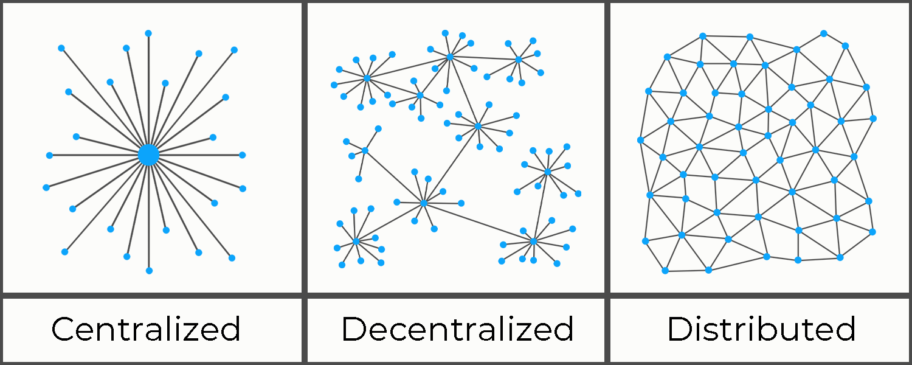

# Decentralization and Nexus

_Decentralisation_ is often used as a general term in crypto for describing trust-less, permission-less and immutable blockchains. The words _Decentralisation_ and _Web3_ are used ambiguously __ in every blockchain. Nevertheless, the distinctions are technically significant: the consensus and topology of networks determines their properties. This article will help you decipher the difference.&#x20;

The above diagram illustrates three different topologies. Centralized and Decentralized are concepts of authority, whereas distribution is a spatial concept, meaning it relates to the physical network topology. A network can be distributed, as well as being centralized or decentralized. An ideal network topology has a decentralized consensus process, with a distributed node topology.

A decentralized cryptocurrency network is a system of many different people using computers or mining hardware, called ‘nodes’ to verify transactions. This type of network is also known as a ‘peer-to-peer network’. None of the nodes or peers have a relative authority over any other. The higher the number of nodes, the more resilient the system is to outside attack or consensus manipulation. Therefore, the more people that contribute resources to a decentralized network, the more secure, resilient, and robust it becomes.

Many blockchains market themselves as decentralized technology. However, ICOs, Security Token Offerings (STO), venture capitalist backing, corporate partnerships, and authoritative consensus implementations, all create favourable conditions for centralization.

Likewise, challenges faced by the original blockchain protocol have also led to cryptocurrencies creating ‘off chain solutions’ that require central nodes or servers. This essentially gives control back to a third-party. Similarly, blockchains that have developed ‘Delegated Proof-of-Stake’ (DPoS) consensus mechanisms have also become more centralized.

### How to check if a project is truly decentralized

Most people believe that everything in crypto world is decentralised, but the reality is completly different, Crypto world is filled with buzzwords and marketing which gives&#x20;

* Decentralized consensus.
* Distributed physical network topology.
* DAO based On-chain community governance.
* On-chain treasury to fund the project.
* Tokenomics and Gamification (Compensation to Network actors)
* Transactions should be Peer-to-Peer (P2P).&#x20;
* No ICO or Premine.
* No Venture Capital (VC) direct funding.
* No single point of centralization in the P2P chain.
* In-built monopolistic safeguards.
* No off-chain or Layer-2 Transactions.
* Interoperability with Chains which don't adhere to decentralization.
* Normal users should be able to access blockchain solutions directly and should be abstracted from the complexity.

### Nexus and Decentralization:

Nexus has been driven by the concept of&#x20;

The more distributed a network is, the more resilient it is overall to various forms of disturbances and the less dependent the network as a whole is on any single node. This also suggests that the network might be less dependent on any particular person, company or organisation that would be operating a particular node. Indeed, the fact that the internet is _decentralised_, in terms of network topology, but not _decentralized_ in authority, has become a major technical argument for why governments and technology companies are able to exert more control over it than the internet pioneers envisioned.&#x20;

The virtual client-server structure, strengthened both through business models and technical means, have allowed companies like Amazon, Facebook and Google to establish highly centralised virtual networks of communications or commerce across decentralised concrete networks. Partly in response to the heavily centralised nature of key online services (search, communication, content distribution), decentralised, or distributed alternatives have been proposed.&#x20;

