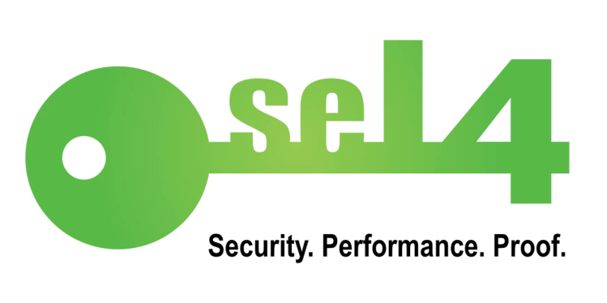
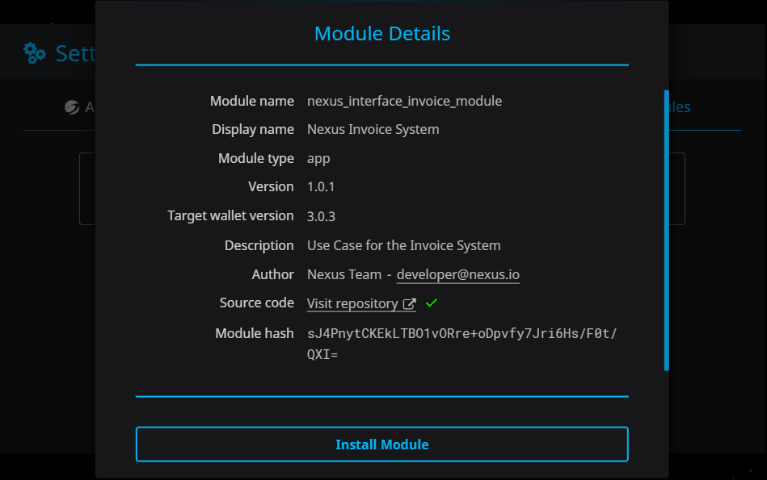

# LX-OS

**What is the LX-OS?**

LX-OS, the Nexus Operating System will initially run on micro-satellites and IoT (Internet of Things) devices, which generally have weak security models. LX-OS will drive the [Nexus Protocol](https://nexus.io/files/nexus\_protocol/Nexus\_Protocol\_1.0.0.pdf), utilizing the immutability of Nexus to verify it’s internal states, making it resistant to most known operating system level exploits. It will be controlled by a security hardened operating system kernel, decentralised by virtue of its security and change-state blockchain-based authentication. This kernel is designed to resist attacks from malware, backdoors, and other vulnerabilities.

Kernel design and management represents a key feature distinguishing operating systems. Kernels are the closest software to your computer’s hardware, often referred to as Ring 0. They allocate and regulate applications with the necessary physical resources while maintaining strong isolation characteristics between processes. Most applications run in an unprivileged ‘user mode’ rather than a privileged ‘kernel mode’ which gives access directly to the hardware.

## **The Foundation: seL4**

Nexus has finally settled upon the seL4 (secure L4) microkernel as a foundation for NexOS. The seL4 microkernel branches from the L4 family of microkernels. This family has enjoyed significant commercial success (including billions in mobile phone sales) and adoption in critical systems around the world ([2](https://en.wikipedia.org/wiki/L4\_microkernel\_family)).&#x20;

Released in 2009 by the [Trustworthy Systems group](http://ts.data61.csiro.au), seL4 focuses on critical systems such as military applications such as drones and satellites. Its core innovation comes from the guarantees in isolation properties between applications and unique approaches to kernel resource management. Specifically, seL4 led the world of operating systems by becoming the first formally verified general purpose microkernel (proofs are limited to only a few instruction sets such as ARM).

Formal verification involves transforming a code’s specification into mathematical abstractions, then constructing proofs to “prove” that the implementation follows the specification ([3](https://www.sciencedirect.com/science/article/pii/S1405774314706596)). Some describe formal verification as proving that bugs can’t occur, but this is imprecise, especially in complex systems where unknown inputs exist.&#x20;

For consumer applications which may be designed for other operating systems, seL4 runs a hypervisor which allows the virtualization of another OS (windows linux, etc.), however a consumer level use implementation of the NexOS won't occur until IoT use cases exhibit success. Overall, SeL4 provides Nexus developers an extremely stable, proven and innovative microkernel to serve as the cornerstone for NexOS.&#x20;

****

LX-OS uses [Signature Chains](https://nexus.io/ResourceHub/signature-chains) to authenticate the runtime memory, file systems, and other system servers. It will operate on a distributed file system, solving the problem of moving the entire App & OS state from one device to another. Listed below, three main innovations illustrate this novel security infrastructure. The first two relate to traditional operating systems components and the third relates to Nexus Protocol routing.

**Runtime memory and binary verification:** Runtime memory provides the temporary storage necessary for processing binary instructions. Operating systems create memory to process code and reclaim that memory once the process is finished. Binary verification refers to the ability to check that the binaries (0s and 1s comprising code) match a referential source. With LX-OS, all executable code must be authenticated either by the source developer or by the user running the application. The hash of the binary you’re installing will have to match the one stored in the developers Signature Chain. Every single runtime instruction will be authenticated with additional checksums. LX-OS ultimately resolves many of the vulnerability issues of today’s Operating Systems (Windows/Linux) that allows hackers to piggyback malware onto PC’s using elevated privileges, because they don’t use a ‘safe’ reference to authenticate changes against. LX-OS will authenticate all changes to the virtual user space across the entire runtime environment.

**File integrity:** Utilizing merkle trees maintains file integrity. Instead of hashing the entire file and storing it as authentication, merkle trees allow hashing of subsets of files, so changes to one part of the file won’t require the rehashing of the entire file. Creating a new file requires a user’s confirmation, generating a new merkle root that is stored in a special object register on Nexus that points to the data.

**Software-defined routers (SDR):** Even after 20 years, the IPV6 protocol upgrade has not been completed, as the upgrade requires global hardware replacement that is unfeasible due to logistics, cost and compatibility complexities. LX-OS will use SDR to replace the ageing and insecure dedicated hardware routing system. It will utilise every device as a stateless router, enabling instant updates to routing and protocols with software updates. It also significantly improves the root of trust, mitigating the inherent risk of centralized entities like BGP, Domain Naming Service (DNS), Certificate Authorities (CA), back doors and similar vulnerabilities. This and the other authentication features remove the ability for many common attack vectors like trojans, injections, DDoS and similar.

****

## **Use-Cases of Lx-OS**

#### **Decentralized Internet:**&#x20;

The Lower-Level Library & LISP (LLLL) provides the basis for the entire Nexus Protocol, which is highlighted in the name LX-OS (L represents the LLLL, X for Nexus, and OS for Operating System). Nexus integrates verification into the LX-OS by interweaving consensus throughout the user and kernel spaces. It leverages Signature Chains and the ledger to authenticate the file system, runtime memory, and any change to the state of the kernel.

#### **Distributed File System:**&#x20;

Data sharding is enabled by the Lower Level Database (LLD), which will allow users to monetize spare disk space for a decentralized network-based cloud equivalent.

#### **Distributed computing framework:**

Inheritance of the distributed database, ledger, and protocols from Nexus constitute a form of distributed virtualization. Users login to their Signature Chains on any device to access a synchronized virtual desktop and file system while up-leveling security to the blockchain. LX-OS provides an important feature that no one in the computer industry has solved, that is, moving the entire app and OS state from one device to another. VMware solves this with VMs in data center servers, but why can’t users migrate their computer OS state to another computer or mobile device? LX-OS solves this by hosting all OS states in the blockchain network (in virtualized space) while the device executes commands. Besides security properties, other desirable features emerge such as offline identity verification and roaming device synchronization.

#### **Internet of Things (IoT):**

IoT is going to be a major use case. Using deterministic hardware identifications for device-level authentications (e.g. International Mobile Equipment Identity — IMEI) with a cryptographic identity based on Signature Chains, is an innovative security control mechanism for the IoT industry. At first the LX-OS will only target IoT use cases, but a consumer version for desktops, tablets and mobile devices will eventually follow, along with a hypervisor, which allows the visualization of another OS (Windows, Mac, Linux etc).

\

**NexOS**&#x20;

This type of design can only be pursued because of the opportunities the distributed ledger provides. Listed below, three main innovations illustrate this novel security infrastructure. The first two relate to traditional components of operating systems, however the third, software defined routers, entails a much larger conversation about physical networks, which we will uncover in the final article.

* Runtime memory and binary verification (e.g. buffer overflow, etc.)
* File integrity via [merkle trees](https://blockonomi.com/merkle-tree/) (e.g. malware, event log manipulation, etc.)
* Software-defined routers (e.g. spoofing, [route poisoning](https://blog.ine.com/igp-route-poisoning-techniques-part-1-ripv2ospf-route-poisoning-techniques), surveillance, etc.)

Runtime memory provides the temporary storage necessary for processing binary instructions. Operating systems create memory to process code and reclaims that memory once the process is finished. Binary verification refers to the ability to check that the binaries (0s and 1s comprising code) match a referential source.&#x20;

With NexOS, all executable code must be authenticated either by the source developer or by the user running the application. To explain, let's look at installing a module on the existing Nexus desktop wallet. The hash of the binary you're installing has to match the hash listed on the github repo. The green check mark signifies that the hashes match:&#x20;

_To make sure it's understood, the image above just shows the pattern the team will extend to the operating system, not an image of its use._

In NexOS, instead of matching with github repo as shown above, the hash will have to match with the one stored in the developers Signature Chain.  Every single runtime instruction will be authenticated with additional checksums.

The team decided to approach File System integrity by utilizing merkle trees. Instead of hashing the entire file and storing that for authentication, merkle trees allow hashing of subsets of files, so changes to one part won't require rehashing of the entire file. Creating a new file requires a user's confirmation, generating a new merkle root that can be stored in a special object register, on the blockchain, that points to the data itself.&#x20;

NexOS significantly improves the root of trust with a distributed ledger, mitigating the inherent risk of Certificate Authorities (CA), 3rd-[party back doors](https://www.ecommercetimes.com/story/81530.html) and similar [vulnerabilities](https://www.theregister.com/2019/11/12/don/). This and the other authentication features remove the ability for many common attack vectors like trojans, injections and similar techniques. NexOS will not be impenetrable, social engineering and similar threats will continue to be a challenge. Although, the design aims to significantly diminish the developmental mistakes, backdoors and related issues that lead to most incidents involving security and privacy compromises
