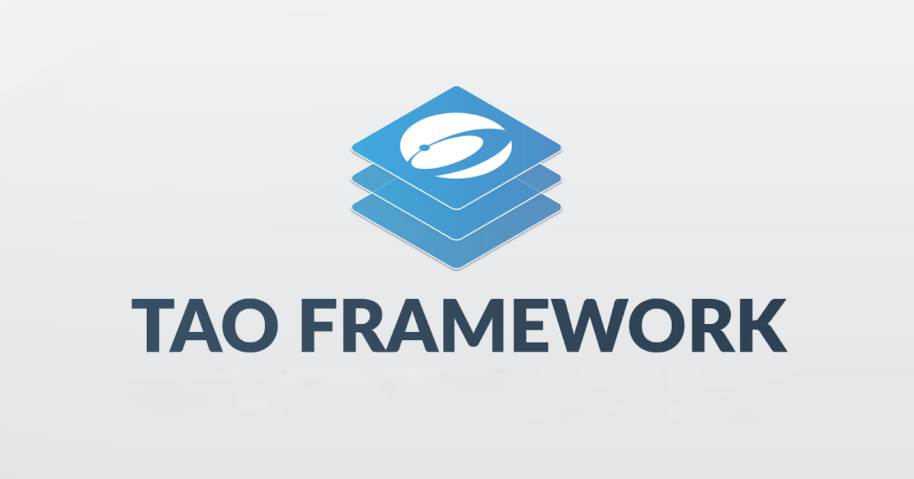

# TAO Framework

Blockchains today are still in its infancy, growing and innovating at a fast pace. To stand out in the crypto ecosystem as a unique and powerful solution needs to tackle the problems in a unique manner.&#x20;

Nexus started out as a clone of peer coin and in 2016 embarked on a upgrade path to a ground breaking framework called TAO. Nexus views the blockchain as a foundational element of a larger framework. The TAO Framework — named for the three phases of deployment: Tritium, Amine and Obsidian.  TAO was the upgrade path to the Nexus blockcahin which

Tritum:

The internet has evolved significantly since its inception, spawning the creation of global protocols, frameworks, and creating new classifications of developers. This has resulted in centralization controversies, superfluous complexities, and lower quality standards loaded with vulnerabilities. The Nexus Tritium, Amine, and Obsidian (TAO) Framework is recomposing these digital relationships, intended to uproot the historic flaws and complications. In this article we will provide an overview of the TAO Framework, recent Application Programming Interface (API) improvements and beneficial aspects related to the evolving technological ecosystems.

As the new era of the internet emerges, many industry platforms are driving excessive emphasis on blockchain. The functionality of blockchain is often described as an exclusive magical technology, while primarily motivated by speculation of values. Observably, this is following a similar dilemma the internet is currently experiencing. Unfortunately, this has created a deceleration of adoption, hindered evolution with crippling costs while enabling proprietary industry sectors to exploit these deficiencies (i.e. Hardware Wallets, Oracles, Patented Products, etc.).

Blockchain and the Internet are disruptive technologies, however only when built with acceptable quality and adherence to decentralized philosophies. In order to realize the promise both technologies have demonstrated, it is important to look and do things differently. The TAO Framework is the embodiment of these new principles that can change perceptions of the internet now and far into the future.

**TAO Framework**

Nexus views the blockchain as a foundational element of a larger framework. The TAO Framework — named for the three phases of deployment: Tritium, Amine, and Obsidian.

&#x20;— utilizing a seven-layered software stack powering a register-based process virtual machine. The TAO Framework is designed to deliver a diverse range of outcomes simplistically and effectively. The layers of the stack and descriptions are reflected below with the more prominent layer, the “Ledger” being the [Three Dimensional Chain (3DC)](https://tech.nexus.io/3dc) .

\
