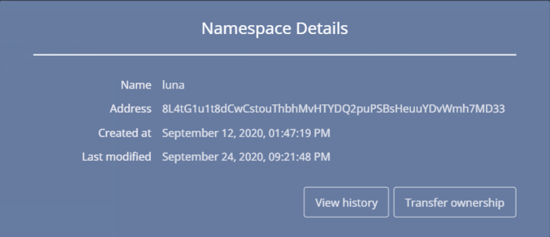
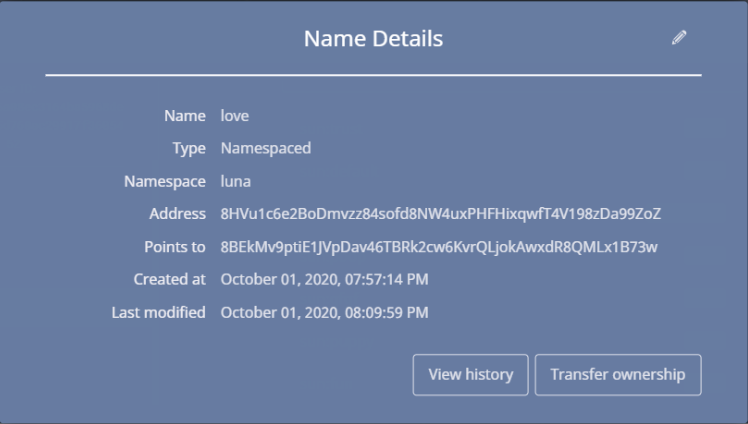

# TAO Naming System

Following in the footsteps of the [Domain Naming System (DNS)](https://www.networkworld.com/article/3268449/what-is-dns-and-how-does-it-work.html), Nexus Tritium, Anime Obsidian (TAO) Framework provides a multi-tiered naming system which offers globally unique identification, personalization and branding opportunities. The TAO Naming System (TNS), perhaps only deserving brief recognition compared to the existing and anticipated technological advancements in Nexus, beckons human creativity to opportunize this unique naming and ownership framework.

&#x20;Three categories exist in the TNS: **local names**, **namespaces**, and **global names**. Names, regardless of the category, technically exist as object registers which route to another register’s address, such as a token, account, or asset. More simply stated, names can be attached and detached from registers. The category of name determines the restrictions on routing, transferability, and address format.&#x20;

**Local Names**

Local names map to registers owned by the individual [Signature Chain (SigChain)](https://tech.nexus.io/signature-chains). These names cost 1 NXS and always resolve to registers. Local names follow the format _username:local\_name_; local names are always prefixed by the SigChain’s username.&#x20;

Local names cannot be transferred to other SigChains, nor can they point to addresses which do not belong to the owner. This implies less value in name squatting SigChains, since the named accounts cannot be sold or gifted to alternative owners unless one gives up the SigChain’s credentials. Usernames and local names invoke less stringent character requirements than namespaces; spaces, symbols, numbers and upper/lowercase letters are all acceptable.

Nexus stands open and accessible since anyone can access local names through their SigChain, but also offers namespaces and global names which cater to more ambitious organizational perspectives.

_Namespace object register. The History tab shows past ownership and events. Ownership can be transferred to any other genesis id or username._

**Namespaces**

Names created in a namespace are addressed as _namespace::name_ as opposed to the single colon format in local names. Compared to local names, names created from a namespace hold unique properties suited for business and organizational opportunities. The ability to route to registers that the owner doesn't control, can help business owners organize payroll and other expenditures.

Namespaces, on the other hand, are designed for organizational or business purposes. **The primary difference between namespaces and local names stems from the ability to transfer ownership of the name and to point to any register address**. Since ownership of names created in a namespace can be transferred, namespace owners can create and then sell names just like owners can sell their blank.com DNS domains. Namespaces can be compared roughly to the .org, .com and .info top-level domains while the name acts like the specific domain address. Namespaces also require stricter character requirements than usernames, limiting possible options to lowercase letters, numbers, and periods.

_Here are details from a name object register (name love) in the luna namespace. See the name gets its own address, while pointing  to another._

Both local and namespaced names can point to the same account register, meaning one could create any amount of different names and point them to the same register. ‘Pointing’ represents the automatic directing of transactions to the target address. As long as a name routes to a register, it will receive control of funds addressed to the name.&#x20;

The owner of the name controls where the name points. So if someone purchased _luna::nexus_ they could attach that name to any account, token, or asset, regardless of the ownership. They could also sell that name to any other user. Once the namespace owner transfers a name, they have no authority over it, so the original owner of the _luna_ namespace cannot control _luna::nexus_ at all, after transferring ownership to another SigChain.

**Global Names**

Global names, on the other hand, represent a completely unique, stand alone names resolving to a register address of the owners choosing. The intention is for global names to represent values such as token tickers, but creative individuals will find other uses. For example, if one were starting a tokenized business called SMART corporation and desired a recognizable and simple name for the token equity, they could create a global name ‘SMART’ and point that name to the token register chosen to represent equity. As long as the global name is pointed to the token register, anyone will be able to find and interact with the token through the name ‘SMART’ &#x20;

Unlike namespaces, global names are not limited to lowercase letters, periods and numbers. However, global name ownership can be transferred just like namespaces and their names, creating the opportunity for secondary markets as well.
