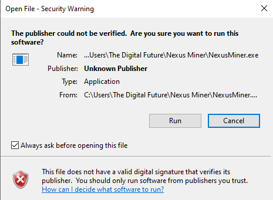
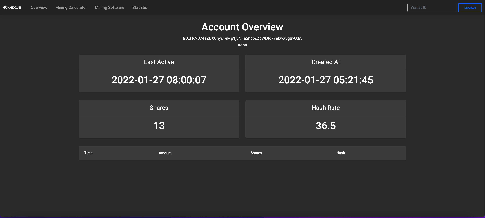
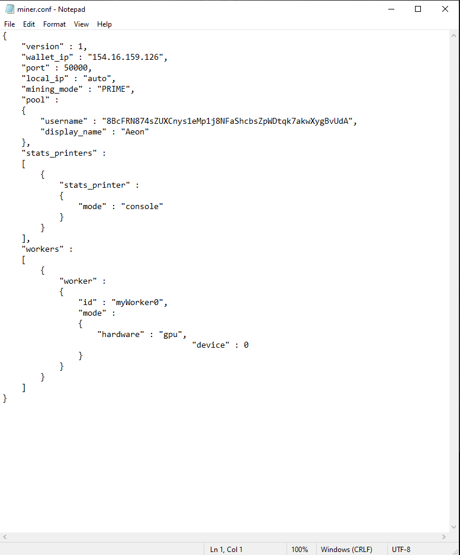
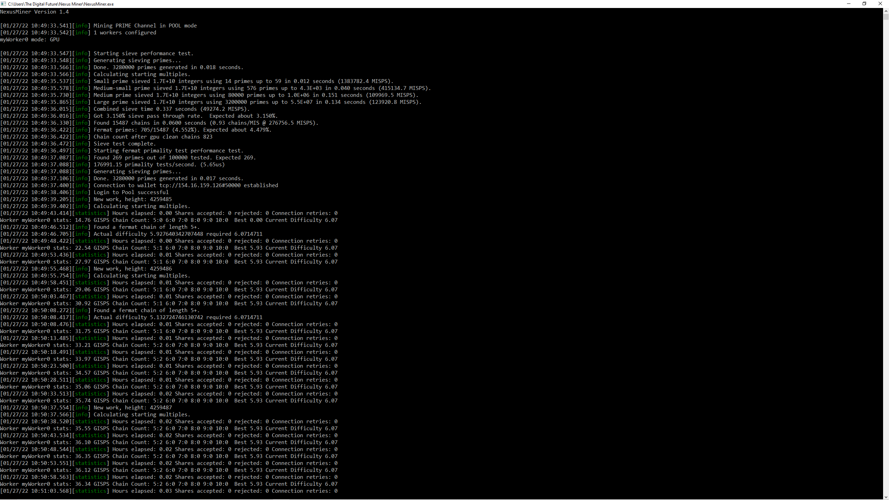
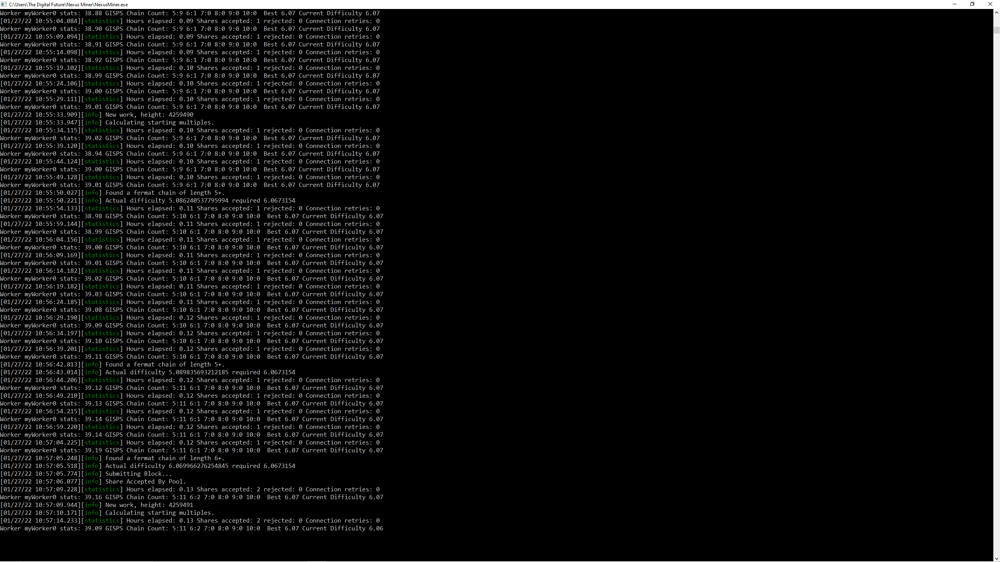
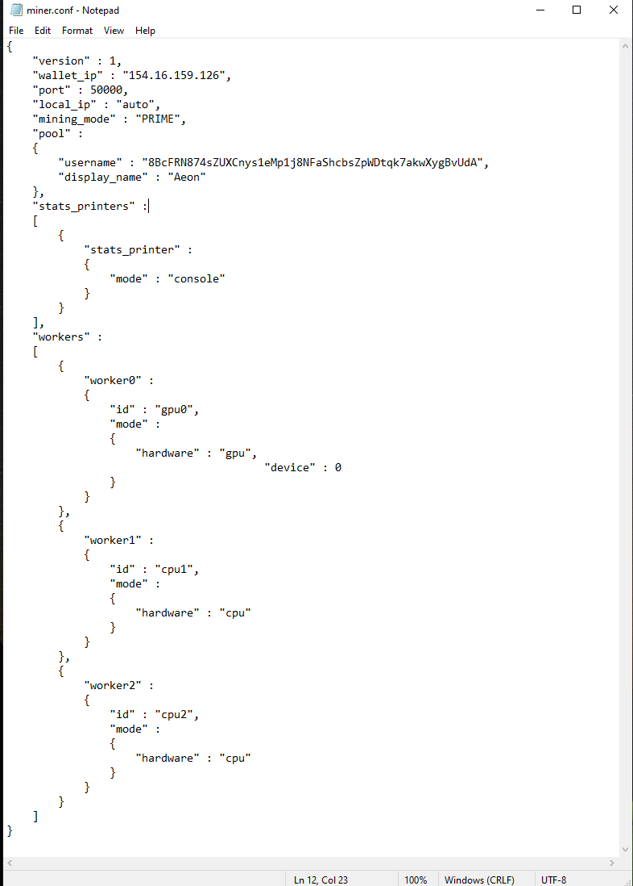
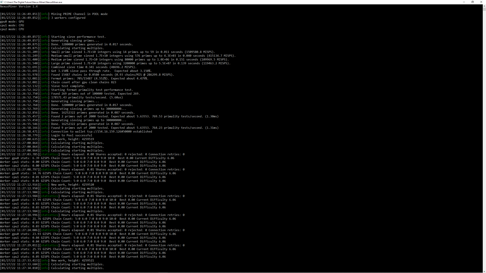

# Mining on Windows

This guide will help to set up mining on Windows. The new NexusMiner makes it very easy to mine on Windows. Nexus has its own open prime mining pool and the developers are working on further decentralizing mining.

### Mining Support:

If you have any kind of support related to mining, please do visit our Telegram channel linked below:



## Mining Channels:

* **Prime Mining:** GPU - Supports both Solo & Pool.
* **Hash Mining:** GPU or FPGA’s - Supports both Solo & Pool.


**Good to Know:** We don't recommend CPU Prime or Hash mining as it is not profitable and only used for testnet mining.


#### Solo Mining&#x20;

Solo means single or individual mining. It requires the miner to be connected to the Nexus wallet. The wallet and miner can be run on the same or a separate computer especially when mining with FPGA’s.&#x20;


**Good to Know:** Solo mining is not profitable for prime and hash, unless you have a very big mining setup.


#### Pool Mining

Pool mining is similar to group mining, and the miner has to be connected to a mining pool. The miner is directly connected to the pool, and the mining rewards are paid to miners depending on the percentage of individual hash rate. There are fees to mine on a pool and that is deducted from the mining payouts.&#x20;

## Mining Pools For Nexus:&#x20;

### Prime Pool:

The Nexus mining team has made available an open prime pool. To use this pool copy the below lines in the miner config.

```
    "wallet_ip" : "primepool.nexus.io", 
    "port" : 50000,
```


**Prime Mining Pool Details**


### Hash Pool:

The Nexus mining developer team run a new hash pool.  To join the pool, use the below lines in the miner config.

```
    "wallet_ip" : "hashpool.nexus.io", 
    "port" : 50000,
```

&#x20;&#x20;


**Good to Know:** Nexus mining devs are working on an open hash pool and it's under testing.


## Compatible Mining Hardware

The NexusMiner can use CPU, GPU for Prime and FPGA for Hash mining. CPU mining is not recommended as it is not efficient.

### &#x20;GPU:

If using GPU mining, the NexusMIner V1.5 supports both nvidia and AMD GPU's. The CUDA cores from Nvidia are fully supported and work efficiently. AMD support has been enabled recently only for prime only on linux and will take some time to be fully efficient.&#x20;

To get the best out of the nvidia graphics cards, we highly recommend to use the latest graphics drivers and [MSI Afterburner](https://www.msi.com/Landing/afterburner/vga).


Do not install the Nvidia content creator drivers, the miner will not work properly


### FPGA:

FPGA miners for Nexus are only available from [Blackminer](https://www.hashaltcoin.com/en/miners). These miners can only be used for Hash mining.

### Mining Calculator:

To get a better understanding of the mining efficiencies of different hardware, use the mining calculator linked below:

[Mining Calculator Link](https://primepool.nexus.io/mining\_calc/)

## Download the Miner:

Download the windows miner executable file from the link below (Not an installer)


The miner cannot run prime and hash at the same time on a single computer




## Miner Configuration:&#x20;

To configure the miner, check the link below:&#x20;


[miner-configuration.md](miner-configuration.md)


## Nexus Desktop Wallet:

<mark style="color:red;">This is only for solo miners. Pool miners can skip this step</mark>&#x20;

### Nexus Interface:

Download and install the Nexus Interface or setup the CLI core.&#x20;

Start the wallet, create the user, login and unlock the wallet for mining and notifications.

#### Mining Settings on Interface:

1. Go to settings > Core > Enable mining by clicking on the toggle button next to it.&#x20;
2. A new field below will pop out below:  Mining IP Whitelist. enter the  `<ipaddress:port>` of the miner. If mining on the same computer then enter `127.0.0.1:9325`,  if the miner is running on another computer or FPGA then enter the particular "`ipaddress:9325`. If there are more than one miner then use ‘; ’to separate the IP addresses. Wildcards ‘_**\*’** are supported for IP addresses only ex: 192.168.10.\*:9325._

### Nexus Core

If using the Nexus core then add a line `llpallowip=<ipaddress:port>` in the nexus.config for each miner. Use 127.0.0.1:9325 for mining on the same computer or the ipaddress:9325 for a separate miner.

Restart the core for the changes to take effect


**Good to Know:** For solo mining to work, the user has to be logged in and unlocked for mining and notifications.


## Run the Miner

Go to the folder where the NexusMiner executable and miner.conf are located, double click on the NexusMiner executable. A security warning window will pop up (shown in image below), click run and the miner will start in a terminal. The miner will run and start mining which you can see from the messages on the miner terminal window. There is no user interaction required.&#x20;



To check if everything is working, go to the mining pool page link below, on the header right side, paste the Nexus address entered in the miner.conf file in the search box and click on search. This will open a page like below, where you can see the details of your miner.&#x20;


**Prime Pool Miner Website**




## Stop the Miner

To stop the miner close the NexusMiner terminal window.

## Screenshots










