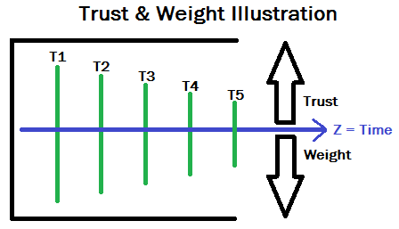
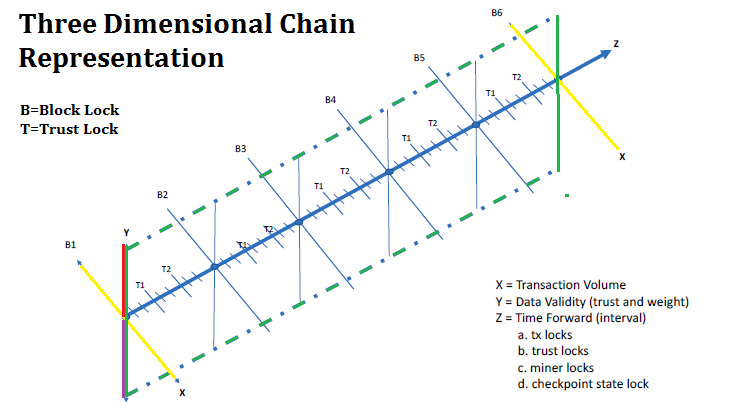
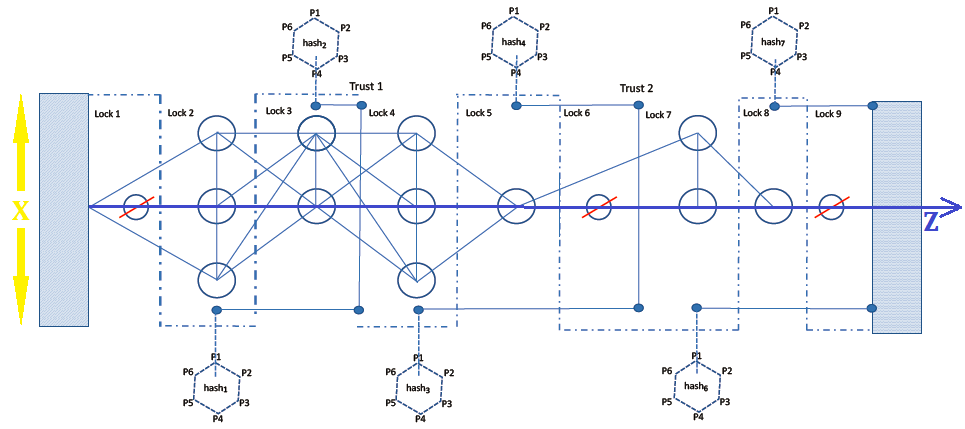

# 3DC - Simplified

## Nexus Three Dimensional Chain Simplified 

The Three Dimensional Chain (3DC) was introduced by Colin Cantrell at the 2017 Nexus Crypto Currency Conference in Aspen, Colorado. The chain has also been referred to as the Multi-Dimensional Chain, or MDC, to reflect future plans to continue evolving the design to include additional dimensions. This new technology has been built from the ground up to improve the basic features offered by Bitcoin, which almost all other digital currencies are based upon. The Nexus 3DC will inherently provide increased security, decentralization, and resource utilization over other traditional blockchains.

I want to briefly explain some of the issues the 3DC addresses before I go into more detail below. First, many contributors, using three different mining methods, are working and being rewarded for each block, increasing decentralization. Second, since many people are able to contribute, only small amounts of data need to be provided, removing the need to own expensive mining machines or large farms of processors to contribute and receive rewards. Third, Nexus was already the most Quantum Resistant currency, and the 3DC makes the security even stronger by reducing the amount of input any one system has in the process.

Why do this? Why take away the power and dominance from the few able to spend the most money? It is simple. The Nexus long-term vision is to be available to everyone regardless of location, access to banking, or economic status. The vision of blockchain technology was supposed to be decentralization… taking away the power from the few and giving it to the many. Mining pools and warehouses full of the latest equipment have made Bitcoin much more centralized than Satoshi ever intended. The question people should be asking is, why is Nexus the only project improving the traditional blockchain to work towards realizing this decentralized vision?

It is important to understand how the Bitcoin blockchain works so we can compare it to the Three Dimensional Chain. In the Bitcoin blockchain everyone is collecting all of the incoming data, and a group of nodes called miners are structuring this data into what are termed blocks. The fastest computers on the Bitcoin network then use a tremendous amount of power in an effort to complete the block first and add it to the blockchain. The first to finish receives the entire BTC reward.

In the Three Dimensional Chain, the transactions arriving first are worked on first. As they are verified they are assigned Weight based on how many acknowledgements have been received for them. At the same time these first transactions are assigned Trust based on the Trust level of those confirming the transactions. These first transactions are then essentially locked in, freeing up resources on the Network to work on the next transactions coming in even before the current block is added to the end of the chain. For me it is easiest to envision a single block broken down into individual segments, with the most current data using the most available network resources, and the older transactions locked in and waiting for the rest of the block data to arrive and be completed.

In the simple illustration below, Transaction 1 (T1) arrived first. It was worked on and agreed upon for the longest amount of time, and has hence received the most Trust and Weight. Subsequent transactions don’t have as much Trust and Weight assigned, so more resources are allocated to their completion. This allows the block to be completed more quickly upon receipt of the late arriving information, and gives many systems on the network the ability to contribute to the block instead of only the first one to complete it, vastly improving decentralization.

That is a very high level illustration to get your thoughts heading in the right direction. Understanding these basic concepts may be all you will remember from this article, but even grasping this helps you to visualize how the Nexus 3DC will increase speed and decentralization over the Bitcoin blockchain. Now I am going to venture into much more detail concerning the individual pieces of the 3DC and how they fit together.

Below is the diagram used by Colin Cantrell in his detailed technical presentation during the 2017 Nexus Conference. I added some colors to highlight the points defined below. There are three Locking Levels within each complete block. I mostly refer to these Levels by their shortened reference of L1, L2 and L3, so it is important to give an overview of each to get started.

The space between B1 and B2 represents 1 Block Lock in the Three Dimensional chain, so in the diagram there are 5 total Block Locks. These are also referred to as Level 3 (L3) Locks.

T1 and T2 represent Trust Locks. Think of these as fractions of a Block Lock completed individually before the block is finished, then grouped and chained together into a single hash. These are referred to as a Level 2 (L2) Locks.

There are many Intervals within each Trust Lock. Within these Intervals are the incoming transactions. These transactions are chained together along the X-Axis. These Intervals are also referred to as Level 1 (L1) Locks, and I go into much more detail on these a little further down.

Z is the Time Forward dimension (blue line) and is easiest to understand. It is simply time moving forward and it continues on into the future.

The X dimension (yellow line) is fluid. It increases and decreases in size based on the number of transactions being handled at any given time. In the current Bitcoin blockchain, a block is set to handle a specific maximum amount of transaction data, and when data is unable to fit into a block, it either waits in a queue to process later, or processes them off-chain (Lightning Network). This inherently reduces decentralization. There will be no off-chain transactions processed in the Three Dimensional Chain.

The Y dimension is represented by both a red/green line above the Z, and a purple/green line below the Z. If you look at the green dotted lines running from the top and bottom of the Y dimension, they represent the continuation of the Y line. The Trust & Weight Illustration graphic above is a simplified example of the Y line.

The red/green line above Z represents Trust, and is calculated based on the amount of trust the individual systems acknowledging the transaction data have on the three Lock Levels. Just as you personally trust friends you have known for a long time more than someone you just met, Nodes on the Network are given more importance the longer they have been contributing. Just like increasing key and hash sizes makes encrypted data harder to break, using time as a factor within the Three Dimensional chain’s security makes it more difficult to violate the rules. If there is a rule broken, such as a double spend attempt, the Trust will be reduced for any nodes verifying the data was accurate.

The purple/green line represents the Weight of the data. Think of the transactions that first arrive as being processed first. These first transactions are worked on and given Weight. As more transactions arrive, these weighted transactions will not need to be worked on again, freeing up resources to work on the newest transactions. Trust is also a factor in Weight. The Trust level of the nodes and signature chains agreeing on a transaction apply their Weight proportionally.

The top down view of the 3DC shows how the three different locking levels will interact to agree on each block. The picture shows the components within one 3DC block. Here you see the Intervals mentioned previously. The circle with the slash means there are no transactions in the first Interval (Lock 1). The three circles in the next Interval (Lock 2) represent three transactions. They are chained together across the X-Axis, and also link back to previous Intervals.

Within the block in the picture, there are 9 Locks, or intervals. Each interval represents detailed work being completed by different Nodes on the Network. In the current Bitcoin blockchain, Proof of Work means one hash is created for the entire block. This means one miner is credited with doing all of the work for the entire block when in reality there are thousands of other miners that have been doing just as much work, just not as quickly.

The Merkle Tree is a well-established and proven way to insure data is complete and accurate, and will be used in the 3DC to insure its integrity. The Merkle Tree allows a single root hash to be calculated from all the miner’s submitted shares and gives the network a final lock that is included in the chaining of L3 locks. Each L2 lock is always chained to previous L2 locks, and each L1 lock is chained to each previous L1. This makes the cryptographic layers increase with security as each consecutive L1, L2, and L3 are created. You can learn more details about the Merkle Tree and its history at the following link.

[https://en.wikipedia.org/wiki/Merkle\_tree](https://en.wikipedia.org/wiki/Merkle\_tree)

The first type of Node role is called a Transaction Node, and is completed by CPU or Prime miners. They will be verifying and creating signatures, as well as calculating prime numbers within the intervals. The miners will only be allowed to complete a limited number of transactions per interval. Also, there will be no increasing “difficulty.” These limitations are geared towards preventing the arms race of node count and computing power on the CPU created L1 locks. This is also true for L2 and L3 locks, giving everyone a chance to contribute to those Levels also.

The second role is fulfilled by the Proof of Stake (PoS) Trust Nodes, and is used to create the Trust Lock hashes. These will consolidate the transactions for the previous Intervals created by CPU miners into a single hash. Using PoS to verify this lock level means the trust associated with the work done is dependent on the quantity of NXS currency held. The L2 locks are far more secure than L1 locks since all of the information from previous intervals is already agreed upon at this stage.

At the end, the third role is performed by the GPU/FPGA/ASIC miners and is used to complete the block by hashing the Merkle Tree created in the previous intervals. This gives miners the ability to participate by just transmitting 512–1024 bytes at a time. This very limited data requirement solves the problem of small and large blocks, making it easy for anyone to mine on limited internet. This will also eliminate orphans, since each share of this data hashed locks it further in the Weight and Trust. In other words, this eliminates the “one hash rules all” philosophy Bitcoin works on today.

Once the block is completed and added to the Three Dimensional Chain, the reward at the end is split up based on one’s contribution to creating the block. This levels the playing field for Nexus contributors while preserving proper checks and balances. With many systems all working together to create blocks at the same time, the network is more robust, secure and scalable.

By intertwining the locked and check-summed L1 and L2 data within each Block Lock, there is no possibility a piece of the final block can ever be modified. Each individual portion has a relationship with the previous portions, so a modification of one transaction cannot mathematically be done without all of the transactions before and after it also being modified. With this in mind, the Lower Level Database (LLD) Colin designed can then, over time, select Nodes to service pieces of the 3DC structure. This allows all nodes to partition their data use and chain storage across each other. Put simply, this means every individual Node does not need to have the entire chain on their system, greatly reducing the bloat all other traditional blockchains will experience as time passes.

I hope this explanation simplified the upcoming Nexus Three Dimensional Chain for you. As a Nexus enthusiast and an active participant in the community, I want everyone to understand how groundbreaking this technology will be. Thanks to the Nexus core team for their help on the details.&#x20;
